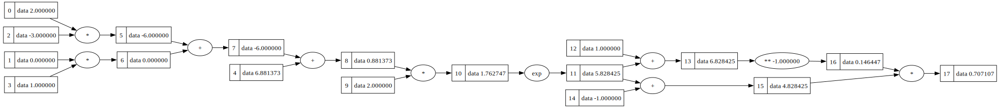

# micrograd_cpp
This is my attempt to write a tiny autograd engine in C++ following Andrej Karpathy's video: [The spelled-out intro to neural networks and backpropagation: building micrograd](https://www.youtube.com/watch?v=VMj-3S1tku0).

The code is a little messy, could be improve. There are still some features and examples that need to be added compared to [karpathy's micrograd](https://github.com/karpathy/micrograd).



## build
```
nmake
```

## run
```
$env:PATH += ";.\Graphviz-12.0.0-win64\bin"
.\demo.exe
```

## debug
```
devenv /DebugExe demo.exe
```
